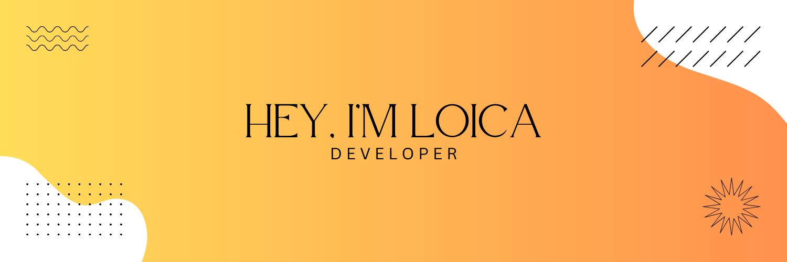

## 🚀 About me
  

- I am an IT student passionate about software development. 
- I am proficient in Next, and Spring Boot.
- I am always eager to learn new technologies. 
- I am a team player and I am always willing to help others. I am also a creative thinker and I am always looking for new ways to solve problems.

## 💫 My goal

 I am looking for opportunities to use my skills and knowledge to make a positive impact on the world. I am also looking for opportunities to learn and grow as a developer.

> ✨ If you are looking for a talented and motivated developer, I would be a great addition to your team. ✨

## 💻 Tools

  

## Stats 〽️
 
<table>
  <tr>
    <td>
      
    </td>
    <td>
      
    </td>
   <td>
     
   </td>
  </tr>
</table>

