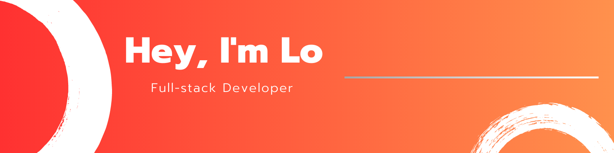

👉 I joined GitHub on `{{ f.date(REGISTRATION_DATE, {date:true}) }}`.
👉 I contributed to `{{ REPOSITORIES_CONTRIBUTED_TO }}` repositories and made `{{ COMMITS }}` commits.

## 🚀 About me

- I am an IT student with a passion for software development. 
- I am proficient in Next, and Spring Boot, and I am always eager to learn new technologies. 
- I am a team player and I am always willing to help others. I am also a creative thinker and I am always looking for new ways to solve problems.

## 💫  My goal

 I am looking for opportunities to use my skills and knowledge to make a positive impact on the world. I am also looking for opportunities to learn and grow as a developer.

> ✨ If you are looking for a talented and motivated developer, I would be a great addition to your team. ✨

  

